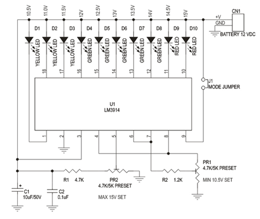
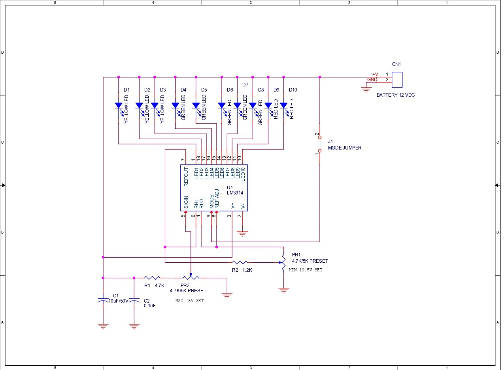
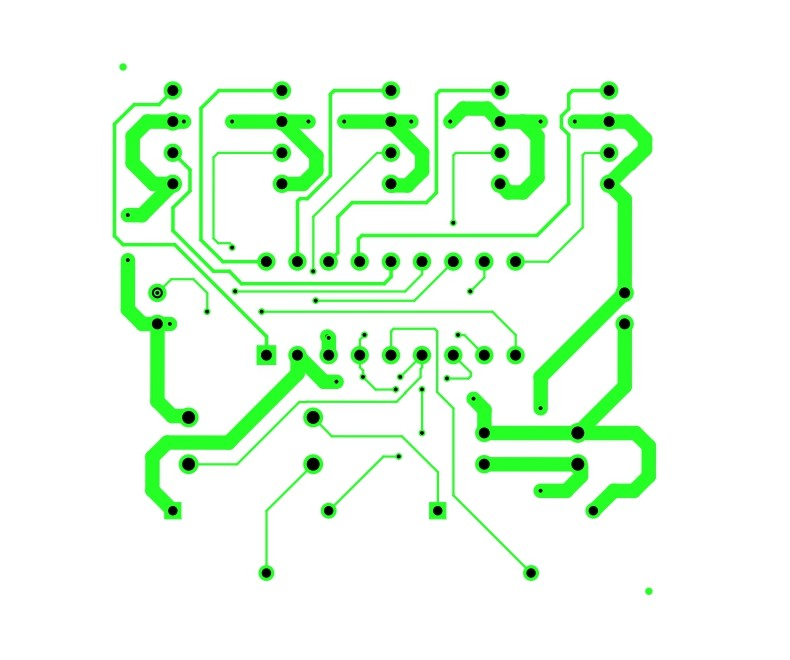
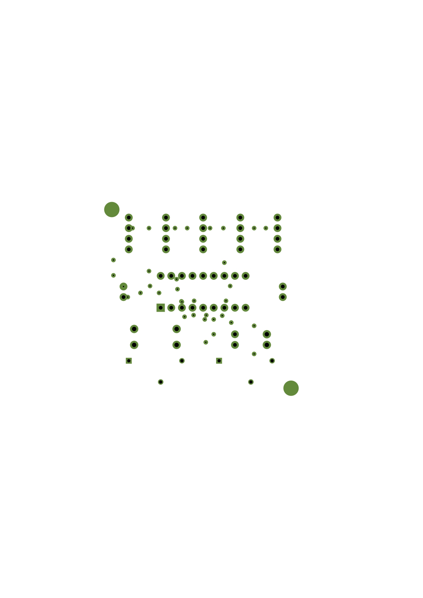
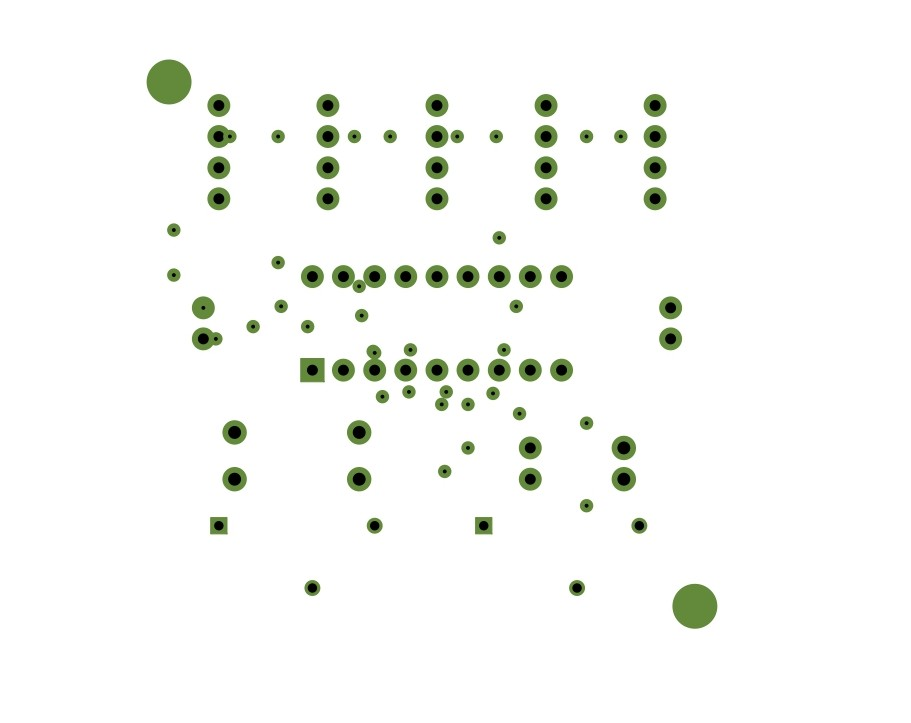
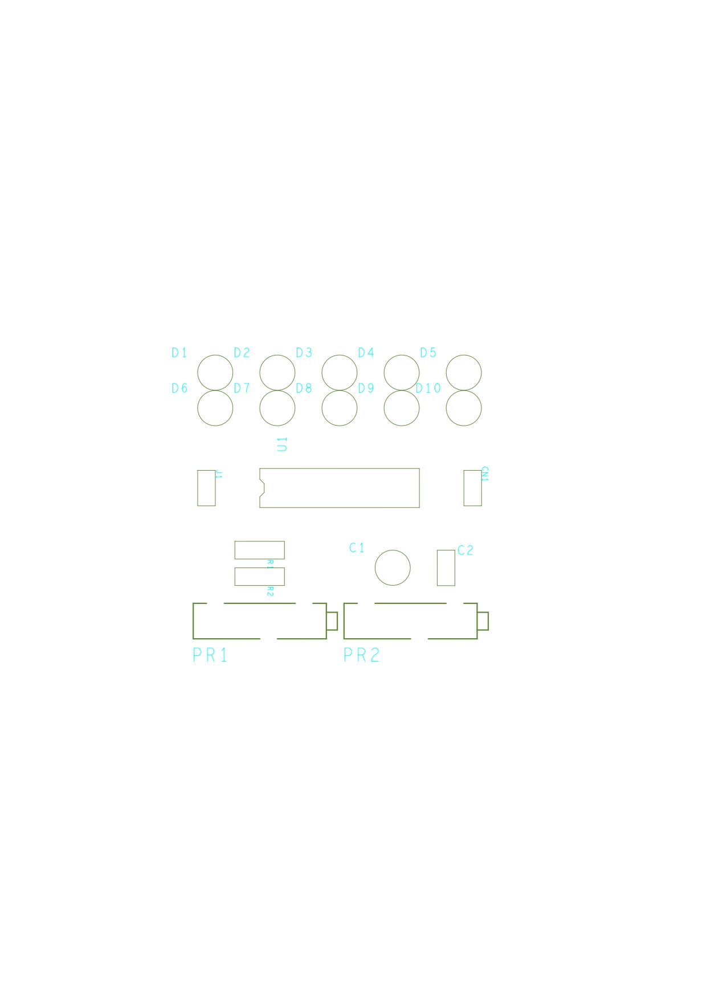
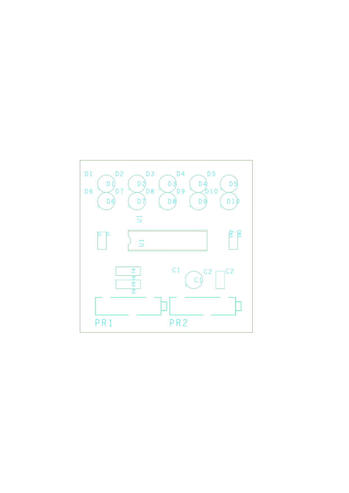
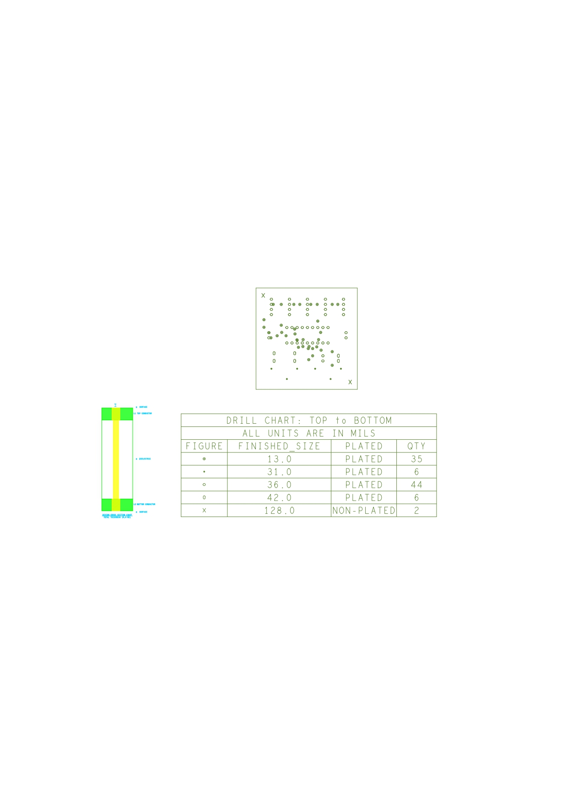
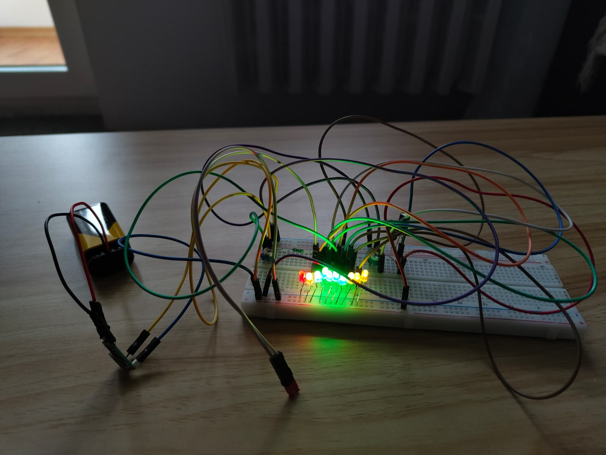
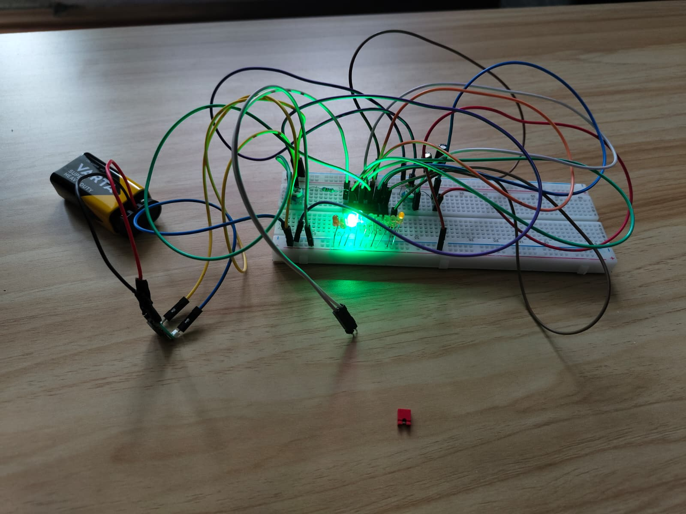

# ⚡ 12V Lead Acid Battery Voltage Monitor

<div align="center">


<br/>

_A compact, self-powered PCB module that visually displays the charge level of a 12V lead-acid battery using 10 color-coded LEDs — no external power supply required._

<br/>

---

</div>

## 📖 Table of Contents

- [About the Project](#-about-the-project)
- [Features](#-features)
- [How It Works](#-how-it-works)
- [Components (BOM)](#-components-bill-of-materials)
- [Schematic](#-schematic)
- [PCB Layers](#-pcb-layers)
- [LED Indicator Guide](#-led-indicator-guide)
- [Calibration](#-calibration)
- [PCB Specifications](#-pcb-specifications)
- [Breadboard Prototype](#-breadboard-prototype)

---

## 🔋 About the Project

This project is a **12V Lead-Acid Battery Voltage Monitor** designed as part of a PCB design course.

The monitor provides a clear, instant visual readout of battery voltage through a bar or dot LED display — powered entirely by the battery it monitors. Built around Texas Instruments' **LM3914** analog display driver IC, the design is compact (50×50 mm), low-power, and fully adjustable.

---

## ✨ Features

| Feature             | Details                                          |
| ------------------- | ------------------------------------------------ |
| 🔌 Supply Input     | 15 VDC Max                                       |
| 💡 LED Output       | 10 LEDs (Bar or Dot mode)                        |
| 🎛️ Display Modes    | BAR (column) / DOT (single LED) via jumper       |
| 🔧 Range Adjustment | Min & Max voltage adjustable via onboard presets |
| ⚡ Self-Powered     | Draws power directly from monitored battery      |
| 🔋 Voltage Range    | 10.5V (min) to 15V (max), fully configurable     |
| 📏 PCB Size         | 50 × 50 mm (square form factor)                  |
| 🕳️ Mounting Holes   | 2× holes (Ø 3.2 mm) on diagonal corners          |
| 🔋 Current Draw     | Typical ~100 mA                                  |

---

## ⚙️ How It Works

The heart of the circuit is the **LM3914** — a monolithic IC from Texas Instruments that senses an analog voltage and drives up to 10 LEDs in a linear display.

```
Battery (12V DC)
      │
      ▼
   CN1 Header ──► LM3914 (U1)
      │               │
   C1 + C2        10 LED Outputs (D1–D10)
   (filtering)        │
      │           ┌───┴────────┐
   PR2 (MAX)    D1-D3       D4-D8      D9-D10
   PR1 (MIN)   YELLOW       GREEN       RED
   R1, R2
   (reference dividers)
```

1. **Signal Input** — Battery voltage enters via the `CN1` 2-pin Berg connector.
2. **Filtering** — `C1` (10µF/50V) and `C2` (0.1µF) stabilize the supply rail.
3. **Voltage Sensing** — The LM3914's `SIGIN` pin (pin 5) compares the input voltage against an internal precision 10-step resistor ladder.
4. **Reference Calibration** — `PR2` (MAX, ~15V) and `PR1` (MIN, ~10.5V) set the top and bottom of the display range using the `RHI` and `REF ADJ` pins.
5. **LED Drive** — The IC activates the corresponding LED outputs (open-collector, current-regulated) to illuminate the LEDs.
6. **Mode Select** — Jumper `J1` connects pin 9 (MODE) to `V+` for **BAR** mode, or leaves it floating for **DOT** mode.

---

## 🧾 Components (Bill of Materials)

| #   | Ref        | Description            | Value / Part         | Qty |
| --- | ---------- | ---------------------- | -------------------- | --- |
| 1   | R1         | Resistor               | 4.7KΩ / 0.25W        | 1   |
| 2   | R2         | Resistor               | 1.2KΩ / 0.25W        | 1   |
| 3   | CN1        | Power Connector        | 2-Pin Berg Connector | 1   |
| 4   | C1         | Electrolytic Capacitor | 10µF / 50V or 63V    | 1   |
| 5   | C2         | Ceramic Capacitor      | 0.1µF                | 1   |
| 6   | D1, D2, D3 | LED                    | Yellow, 5mm          | 3   |
| 7   | D4–D8      | LED                    | Green, 5mm           | 5   |
| 8   | D9, D10    | LED                    | Red, 5mm             | 2   |
| 9   | U1         | Display Driver IC      | LM3914               | 1   |
| 10  | SOCKET     | IC Socket              | 18-Pin DIP           | 1   |
| 11  | PR1, PR2   | Preset Potentiometer   | 4.7K/5K              | 2   |
| 12  | J1         | Jumper                 | 2-Pin with closer    | 1   |

> 💰 **Estimated total project cost:** ~18–20 RON  
> 🛒 Sources: [Optimusdigital.ro](https://www.optimusdigital.ro), [TME.eu](https://www.tme.eu), [emag.ro](https://www.emag.ro), [electronicmarket.ro](https://electronicmarket.ro)

---

## 📐 Schematic

### Initial Reference Schematic

> The reference schematic used as a starting point for the PCB design:

> 

---

### Final CAD Schematic (OrCAD Capture)

> The finalized schematic drawn in Cadence OrCAD:

> 

---

## 🗂️ PCB Layers

The PCB was designed in **Cadence OrCAD PCB Editor 17.2** and exported as Gerber RS-274X files.

### 🟢 Layer TOP (Etch/Top Copper)

> 
> _Top copper layer — signal routing_

---

### 🟡 Layer BOTTOM (Etch/Bottom Copper)

> 
> _Bottom copper layer — ground plane and return paths_

---

### 🟫 Layer SOLDER MASK TOP

> 
> _Top solder mask — exposes only pads for soldering_

---

### 🟫 Layer SOLDER MASK BOTTOM

> 
> _Bottom solder mask_

---

### 🔵 Layer SILK SCREEN TOP

> 
> _Component reference designators and outlines_

---

### 📋 Layer ASSEMBLY DRAWING TOP

> 
> _Full assembly view showing all component placements_

---

### 🏭 Layer FABRICATION

> 
> _Board outline, dimensions, and drill chart_

**Drill Chart (TOP to BOTTOM):**

| Symbol | Finished Size (mils) | Plated     | Qty |
| ------ | -------------------- | ---------- | --- |
| ●      | 13.0                 | PLATED     | 35  |
| ✦      | 31.0                 | PLATED     | 6   |
| ○      | 36.0                 | PLATED     | 44  |
| ◌      | 42.0                 | PLATED     | 6   |
| ✕      | 128.0                | NON-PLATED | 2   |

---

## 💡 LED Indicator Guide

The 10 LEDs are color-coded for instant battery status recognition:

```
  10.5V  11V  11.5V  12V  12.5V  13V  13.5V  14V  14.5V  15V
   D1    D2    D3    D4    D5    D6    D7    D8    D9    D10
  [🟡]  [🟡]  [🟡]  [🟢]  [🟢]  [🟢]  [🟢]  [🟢]  [🔴]  [🔴]
 YELLOW YELLOW YELLOW GREEN  GREEN  GREEN  GREEN  GREEN  RED   RED
```

| Color     | LEDs               | Voltage Range  | Battery Status       |
| --------- | ------------------ | -------------- | -------------------- |
| 🟡 Yellow | D1, D2, D3         | ~10.5V – 11.5V | ⚠️ Low — charge soon |
| 🟢 Green  | D4, D5, D6, D7, D8 | ~12V – 13.5V   | ✅ Normal / Optimal  |
| 🔴 Red    | D9, D10            | ~14V – 15V     | 🔺 High / Overcharge |

**Display Modes (Jumper J1):**

- **BAR mode** `[J1 closed]` — All LEDs from minimum up to current level stay lit (like a fuel gauge)
- **DOT mode** `[J1 open]` — Only the single LED at the current voltage level lights up (lower power consumption)

---

## 🎛️ Calibration

Two onboard trimpots allow field calibration without any extra equipment:

| Preset  | Pin             | Function                                               | Default Target |
| ------- | --------------- | ------------------------------------------------------ | -------------- |
| **PR2** | SIGIN (pin 5)   | **MAX voltage** — sets the top of the display range    | ~15V           |
| **PR1** | REF ADJ (pin 8) | **MIN voltage** — sets the bottom of the display range | ~10.5V         |

**Calibration procedure:**

1. Apply a known reference voltage (e.g. 15V) to CN1
2. Adjust **PR2** until only D10 (rightmost LED) lights in DOT mode
3. Apply minimum reference voltage (e.g. 10.5V)
4. Adjust **PR1** until only D1 lights in DOT mode

---

## 📏 PCB Specifications

| Parameter       | Value                                    |
| --------------- | ---------------------------------------- |
| Board Shape     | Square                                   |
| Dimensions      | 50 × 50 mm                               |
| Mounting Holes  | 2× Ø 3.2 mm                              |
| Hole Placement  | Diagonal corners, 2M distance from edges |
| Layers          | 2 (Top + Bottom copper)                  |
| Min Track Width | 0.2 mm                                   |
| Min Via Drill   | 1.2 mm                                   |
| Min Clearance   | 0.35 mm                                  |
| Software        | Cadence OrCAD PCB Editor 17.2S025        |
| Output Format   | Gerber RS-274X                           |

---

## 🔬 Breadboard Prototype

> The circuit was first assembled and tested on a breadboard to verify functionality before committing to PCB layout.

<table>
  <tr>
    <td align="center">
      <br/>
      <sub><b>Bar Mode</b></sub>
    </td>
    <td align="center">
      <br/>
      <sub><b>Dot Mode</b></sub>
    </td>
  </tr>
</table>

---

<div align="center">

_Designed with ❤️ using Cadence OrCAD 17.2 · 2025–2026_

</div>
